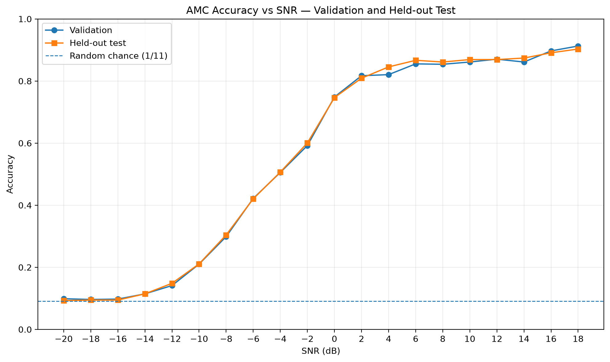
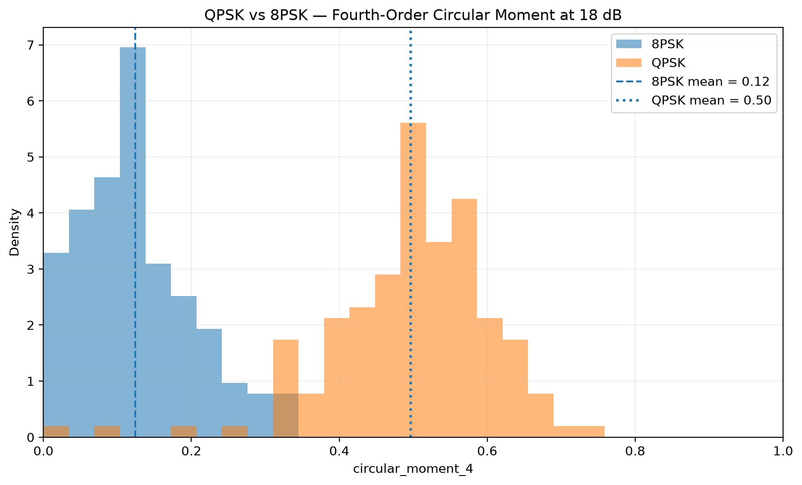
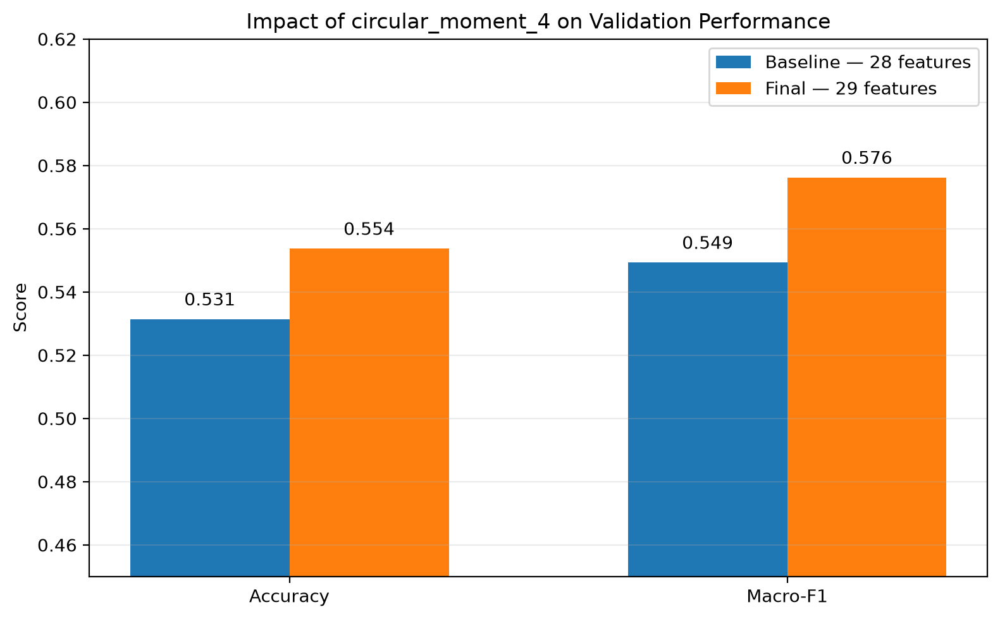
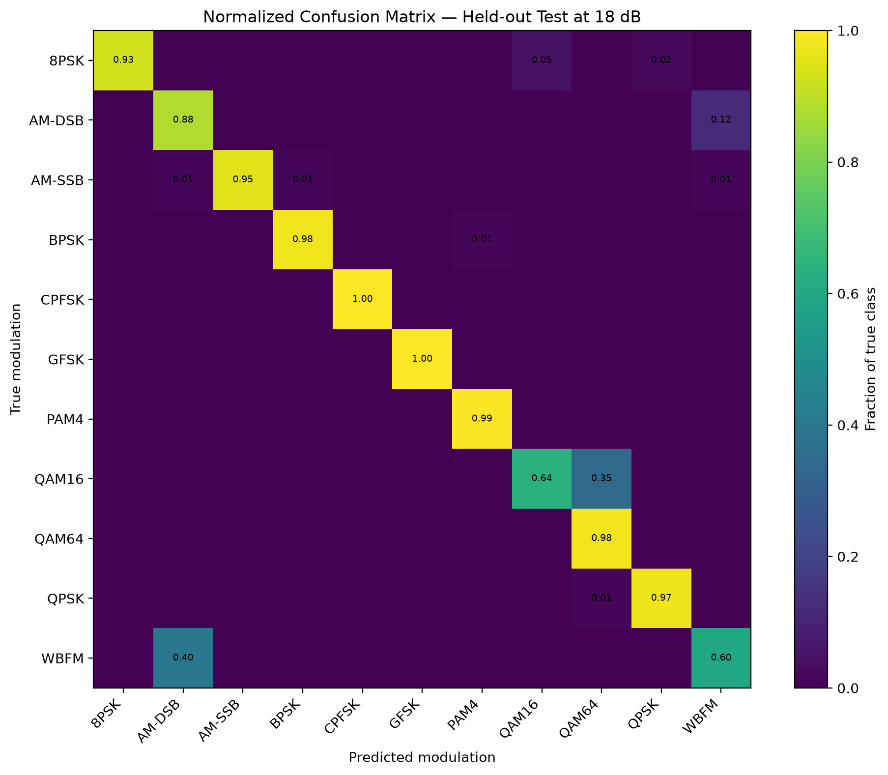

# SNR-Aware Automatic Modulation Classification

Machine learning project for **Automatic Modulation Classification (AMC)** from complex I/Q radio signals under different Signal-to-Noise Ratio (SNR) conditions.

The project uses the **RadioML 2016.10A** dataset and focuses not only on classification performance, but also on understanding **how and why performance changes with SNR**, identifying systematic error modes, and improving the signal representation through physically motivated feature engineering.

The final system uses a **Random Forest classifier with 29 handcrafted signal features**.

---

## Key results

The final model was frozen before opening the independent held-out test set.

### Held-out test performance

| Metric | Result |
|---|---:|
| Accuracy | **55.62%** |
| Macro-F1 | **57.86%** |

These global values include the complete RadioML SNR range from **-20 dB to +18 dB**, including extremely noisy conditions where classification approaches random chance.

Performance is substantially higher when the received signal contains enough recoverable modulation structure.

### Performance in different SNR regimes

| SNR range | Mean Accuracy | Mean Macro-F1 |
|---|---:|---:|
| **SNR >= 0 dB** | **85.35%** | **85.09%** |
| **SNR >= 6 dB** | **87.63%** | **87.41%** |
| **SNR >= 10 dB** | **88.12%** | **87.93%** |
| **18 dB** | **90.30%** | **90.14%** |

For non-negative SNR conditions, the model achieves approximately **85% average accuracy**, increasing to more than **90% accuracy at 18 dB**.

The values reported for SNR ranges correspond to the mean performance across the included SNR levels.

---

## Accuracy across SNR



The classification problem becomes progressively easier as signal quality improves.

At **-20 dB**, test accuracy is approximately **9.27%**, very close to the random-chance level of:

```text
1 / 11 = 9.09%
```

At **0 dB**, accuracy rises to approximately **74.67%**, while at **18 dB** it reaches **90.30%**.

The held-out test curve also closely follows the validation curve, providing evidence that the observed SNR-dependent behaviour generalizes to unseen signals.

---

## Generalization consistency

Performance remained highly consistent across the different evaluation stages:

| Evaluation | Accuracy | Macro-F1 |
|---|---:|---:|
| Training OOF | 55.43% | 57.65% |
| Validation | 55.37% | 57.62% |
| **Held-out test** | **55.62%** | **57.86%** |

The close agreement between out-of-fold training, validation and independent test results suggests limited overfitting and stable generalization.

---

## Dataset

This project uses the **RadioML 2016.10A** dataset for modulation recognition.

It contains:

- **220,000** I/Q signal examples
- **11 modulation classes**
- **20 SNR levels**, from -20 dB to +18 dB in 2 dB steps
- **1,000 examples** for every modulation/SNR combination
- **128 complex samples** per signal
- Input representation: `(2, 128)` corresponding to the I and Q components

### Modulation classes

The eleven modulation types are:

```text
8PSK
AM-DSB
AM-SSB
BPSK
CPFSK
GFSK
PAM4
QAM16
QAM64
QPSK
WBFM
```

### Data split

The dataset was split using joint stratification by **modulation and SNR**:

| Split | Percentage | Samples |
|---|---:|---:|
| Training | 70% | 154,000 |
| Validation | 15% | 33,000 |
| Test | 15% | 33,000 |

The test set remained closed throughout model development and was evaluated only after the final model configuration and feature representation had been frozen.

---

## Methodology

The project follows a signal-processing-driven classical machine learning workflow:

```text
Raw I/Q signals
       |
       v
Exploratory signal analysis
       |
       v
Handcrafted feature extraction
       |
       v
28-feature baseline representation
       |
       v
Classical ML model comparison
       |
       v
Random Forest baseline
       |
       v
SNR-dependent evaluation
       |
       v
Detailed error analysis
       |
       v
Pairwise modulation analysis
       |
       v
Physically motivated feature engineering
       |
       v
29-feature final representation
       |
       v
Frozen Random Forest
       |
       v
Independent held-out test
```

SNR is used for **stratification, evaluation and error analysis**, but it is **not provided to the Random Forest as an input feature**.

This allows the classifier to operate directly from the received I/Q samples without requiring prior knowledge of the true SNR.

---

## Feature engineering

Each raw `(2, 128)` I/Q observation is converted into a compact handcrafted feature representation.

The original representation contains **28 features**, including:

- I/Q statistical descriptors
- magnitude statistics
- signal power and RMS
- Peak-to-Average Power Ratio (PAPR)
- phase-difference statistics
- skewness and kurtosis
- normalized autocorrelation
- spectral centroid
- spectral bandwidth
- spectral entropy
- spectral flatness
- spectral peak information

### Physically motivated PSK feature

Error analysis revealed that one of the most persistent high-SNR limitations of the baseline model was confusion between **QPSK and 8PSK**.

The original representation successfully identified PSK-like signals but did not represent their angular order sufficiently well.

A fourth-order circular moment was therefore introduced:

```python
circular_moment_4 = abs(
    mean(
        (x / (abs(x) + eps)) ** 4
    )
)
```
### Physical separation of QPSK and 8PSK

The effect of the new feature can also be observed directly in its
distribution for QPSK and 8PSK signals.

The following figure shows `circular_moment_4` on validation signals at
**18 dB SNR**:



QPSK exhibits stronger fourth-order angular coherence because its
four-fold rotational structure is reinforced when the normalized complex
signal is raised to the fourth power.

For 8PSK, the eight possible phase states do not align in the same way,
producing greater cancellation in the fourth-order circular mean.

This provides the classifier with modulation-order information that was
poorly represented by the original handcrafted feature set.
Normalizing the complex samples removes most amplitude information and emphasizes angular structure.

The fourth power is particularly useful for detecting the rotational symmetry associated with QPSK.

The final representation therefore contains:

```text
28 baseline features
+
1 circular_moment_4
=
29 final features
```

On validation data, this modification increased Macro-F1 from approximately:

```text
0.5493 -> 0.5762
```
### Impact on validation performance

Adding only `circular_moment_4` improved both global validation metrics:



The final representation improves:

```text
Accuracy:
53.14% -> 55.37%
+2.23 percentage points

Macro-F1:
54.93% -> 57.62%
+2.69 percentage points
while adding only one feature to the model.

---


## Error analysis

A major part of the project focused on understanding **where the classifier fails and why**, rather than relying only on global accuracy.

### High-SNR classification behaviour

At high SNR, most modulation classes become clearly separable.

The normalized confusion matrix below shows the behaviour of the final
classifier on the independent held-out test set at **18 dB**.



The model achieves **90.30% accuracy at 18 dB**.

Several modulation families are recognized almost perfectly, including
BPSK, CPFSK, GFSK, PAM4, QPSK and QAM64.

The two main remaining error patterns are:

- QAM16 being classified as QAM64.
- WBFM being classified as AM-DSB.

Importantly, the previous QPSK/8PSK confusion is now substantially reduced.
### Extreme low-SNR regime

At very low SNR, AWGN dominates the observations and the handcrafted representations of different modulation classes become increasingly similar.

The model develops a strong tendency to assign uncertain signals to the **AM-SSB decision region**.

This does not mean that noisy signals physically become AM-SSB.

Instead, modulation separability collapses in the available feature space and the learned Random Forest decision boundaries preferentially map many low-information observations to that class.

At -20 dB, performance is therefore close to random chance.

---

### QPSK vs 8PSK

This was one of the clearest representation problems found during development.

Before physically motivated feature engineering, substantial confusion remained between QPSK and 8PSK even at high SNR.

After introducing `circular_moment_4`, performance improved substantially.

At **18 dB on the independent test set**:

```text
8PSK recall ≈ 0.93
QPSK recall ≈ 0.97
```

The previous mutual confusion between both PSK orders is largely removed.

---

### QAM16 vs QAM64

This remains one of the main residual high-SNR classification errors.

At 18 dB:

```text
QAM16 recall ≈ 0.64
QAM64 recall ≈ 0.98
```

A substantial fraction of QAM16 signals are still classified as QAM64.

Several amplitude, radial-distribution and cumulant-based features were investigated, but they did not improve end-to-end classification performance and were therefore rejected from the final representation.

---

### WBFM vs AM-DSB

The other major residual ambiguity is between the analog modulations **WBFM and AM-DSB**.

At 18 dB, approximately:

```text
WBFM recall ≈ 0.60
```

with a significant fraction of WBFM signals classified as AM-DSB.

Instantaneous-frequency and spectral-sideband features were investigated during development. They provided only a small global improvement and were not retained in the final model.

---

## Models investigated

Several classical machine learning algorithms were compared using the handcrafted signal representation.

Approximate development results were:

| Model | Macro-F1 |
|---|---:|
| Logistic Regression | 0.474 |
| HistGradientBoosting | 0.502 |
| Random Forest | 0.526 |

The **Random Forest** was selected as the main classifier.

The final frozen configuration is:

```python
RandomForestClassifier(
    n_estimators=200,
    max_depth=20,
    min_samples_leaf=2,
    random_state=42,
    n_jobs=-1,
)
```

Hyperparameter search did not produce enough improvement to justify replacing this configuration.

---

## Alternative approaches investigated

The project also explored more complex strategies for difficult modulation pairs.

A selective **mixture-of-experts** approach was tested using specialized binary classifiers for:

```text
QPSK vs 8PSK
QAM16 vs QAM64
WBFM vs AM-DSB
```

Although the specialist models could improve pairwise discrimination, routing them into the global classifier produced only a negligible end-to-end improvement.

The additional complexity was therefore rejected.

This led to an important design decision:

> prefer a simpler global model when additional architectural complexity does not provide a meaningful measurable benefit.

---

## Final model

The final model consists of:

```text
Input:
    2 x 128 I/Q samples

Feature extraction:
    29 handcrafted features

Classifier:
    Random Forest

Trees:
    200

Maximum depth:
    20

Minimum samples per leaf:
    2

Output:
    11 modulation probabilities
    +
    predicted modulation
```

Final independent test performance:

```text
Accuracy:  55.62%
Macro-F1: 57.86%
```

For SNR >= 0 dB:

```text
Mean Accuracy:  85.35%
Mean Macro-F1: 85.09%
```

At 18 dB:

```text
Accuracy:  90.30%
Macro-F1: 90.14%
```

---

## Inference pipeline

Reusable inference functionality is implemented in:

```text
src/rfml/inference.py
```

The complete prediction process is:

```text
Raw I/Q signal
      |
      v
extract_features(..., feature_set="full_final")
      |
      v
29 ordered features
      |
      v
Frozen Random Forest
      |
      v
Predicted modulation
+
confidence
+
class probabilities
```

Example:

```python
from rfml.inference import (
    load_model_and_metadata,
    predict_modulation,
)

model, metadata = load_model_and_metadata(
    model_path,
    metadata_path,
)

result = predict_modulation(
    sample,
    model,
    metadata,
)

print(result["predicted_modulation"])
print(result["confidence"])
print(result["probabilities"])
```

The model metadata stores the exact feature schema required at inference time.

---

## Repository structure

```text
snr-aware-modulation-classification/
|
├── app/
|   └── Interactive demonstration
|
├── configs/
|   └── Project configuration
|
├── data/
|   ├── raw/
|   └── processed/
|       Local datasets excluded from Git
|
├── models/
|   ├── final_rf_29_features.json
|   └── final_rf_29_features.joblib
|       Large model binary excluded from Git
|
├── notebooks/
|   ├── 00_environment_setup.ipynb
|   ├── 01_data_loading.ipynb
|   ├── 02_exploratory_analysis.ipynb
|   ├── 03_baseline_models.ipynb
|   ├── 04_model_tuning.ipynb
|   ├── 05_snr_evaluation.ipynb
|   ├── 06_error_analysis.ipynb
|   ├── 07_physical_feature_engineering.ipynb
|   └── 08_final_test.ipynb
|
├── reports/
|   └── figures/
|       └── accuracy_vs_snr_validation_test.png
|
├── scripts/
|   └── Reproducible execution scripts
|
├── src/
|   └── rfml/
|       ├── data.py
|       ├── features.py
|       ├── inference.py
|       └── splits.py
|
├── tests/
|
├── .gitignore
├── README.md
├── requirements.txt
└── requirements-lock.txt
```

---

## Installation

Clone the repository:

```bash
git clone <repository-url>
cd snr-aware-modulation-classification
```

Create a virtual environment:

```bash
python -m venv .venv
```

On Windows PowerShell:

```powershell
.\.venv\Scripts\Activate.ps1
```

Install the project dependencies:

```bash
pip install -r requirements.txt
```

For the exact development environment:

```bash
pip install -r requirements-lock.txt
```

---

## Reproducibility

The raw RadioML dataset and generated feature datasets are intentionally excluded from Git because of their size.

The serialized final Random Forest is also excluded from the repository because the compressed model is approximately **95 MB**.

The repository versions the components required to document and reproduce the methodology:

- feature extraction code
- exact final feature schema
- train/validation/test methodology
- experimental notebooks
- final evaluation notebook
- inference pipeline
- model metadata
- result figures

The final model metadata can be found at:

```text
models/final_rf_29_features.json
```

---

## Main conclusions

This project demonstrates that Automatic Modulation Classification performance must be interpreted in the context of signal quality.

The final classifier achieves **55.62% accuracy across the complete -20 to +18 dB benchmark**, but this number includes extremely noisy observations where modulation information is almost completely buried by noise.

For **SNR >= 0 dB**, average test accuracy rises to approximately **85.35%**, and the model exceeds **90% accuracy at 18 dB**.

Detailed error analysis showed that different SNR regimes present fundamentally different problems:

- extreme noise causes global feature-space collapse;
- QPSK/8PSK required a better representation of angular symmetry;
- QAM16/QAM64 remains difficult because of modulation-order ambiguity;
- WBFM/AM-DSB remains the main analog-modulation confusion.

The most successful improvement was not a larger model or a more complex architecture, but a **single physically motivated feature**: `circular_moment_4`.

This increased global Macro-F1 while substantially reducing the targeted QPSK/8PSK error.

The final result is therefore a relatively compact and interpretable classical machine learning pipeline whose behaviour has been analyzed across the complete SNR range.

---

## Project status

**Machine learning experimentation: complete**

The final feature set, classifier configuration and held-out test evaluation are frozen.

Current work focuses on:

- result visualization
- repository documentation
- reproducible inference
- interactive demonstration